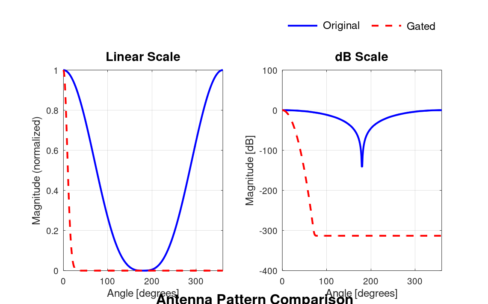
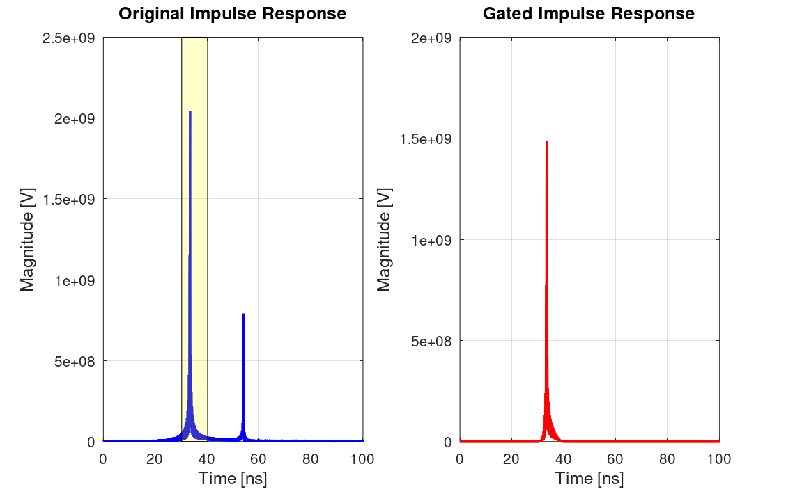
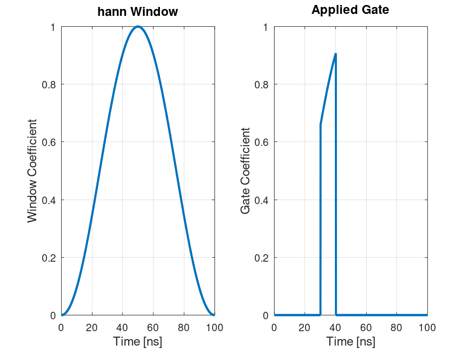

# TimeDomainGating

**A MATLAB simulation framework for time-domain gating of antenna measurements in the presence of multipath propagation.**

TimeDomainGating simulates physically-based multipath propagation and implements automatic time-domain gate optimization for antenna measurement systems. It combines frequency-dependent Fresnel reflections, Friis transmission modeling, and adaptive gating algorithms to suppress multipath interference while preserving antenna pattern accuracy.

---

## Table of Contents

- [Overview](#overview)
- [Key Features](#key-features)
- [Repository Structure](#repository-structure)
- [Installation](#installation)
- [Quick Start](#quick-start)
- [Result Figures](#result-figures)
- [Core Modules](#core-modules)
- [Configuration](#configuration)
- [Theory](#theory)
- [Signal Processing Pipeline](#signal-processing-pipeline)
- [Performance Metrics](#performance-metrics)
- [Window Functions](#window-functions)
- [References](#references)
- [License](#license)

---

## Overview

Antenna range measurements are often corrupted by reflections from chambers, mounts, and surrounding structures. This framework provides an end-to-end simulation pipeline — from physical channel synthesis through frequency/time-domain conversion, adaptive gate optimization, and pattern reconstruction — to study and demonstrate how time-domain gating suppresses multipath while preserving the antenna's true radiation pattern.

## Key Features

**Physics Simulation**
- Friis transmission equation for free-space path loss
- Frequency-dependent Fresnel reflection coefficients
- Multipath propagation with configurable reflection order
- Accurate propagation delay and LOS/NLOS path geometry

**Signal Processing**
- Frequency-domain transfer function synthesis
- Zero-padded IFFT for high time resolution
- Adaptive, automatic gate-parameter optimization
- Rectangular, Hann, Hamming, Blackman, Kaiser, and Tukey windows
- Pattern reconstruction from gated measurements

**Experiments & Analysis**
- Gate window comparison studies
- SNR vs. gate-width tradeoff analysis
- Bandwidth, delay resolution, and reflection-strength sensitivity studies

**Visualization**
- Publication-quality figures (PNG/PDF), auto-exported to `results/figures/`

## Repository Structure

```
TimeDomainGating/
├── main.m                  # Entry point
├── config/                 # Simulation, antenna, and channel configuration
├── channel/                # Multipath channel simulation (Friis, Fresnel, delays)
├── signal/                 # FFT/IFFT, gating, normalization
├── gating/                 # Window creation and gate optimization
├── antenna/                # Radiation pattern generation & reconstruction
├── noise/                  # AWGN and SNR estimation
├── experiments/            # Standalone experiment scripts
├── plotting/               # Publication-quality plotting utilities
├── utils/                  # Validation, conversions, error metrics
├── results/                # Output figures, data, and logs (generated at runtime)
│   ├── figures/
│   ├── data/
│   └── logs/
└── documentation/          # Theory, equations, user guide
```

> **Note:** `results/` is generated when you run `main.m` — it is not pre-populated in the repository. Run the simulation once to produce the figures referenced below.

## Installation

**Requirements**
- MATLAB R2023a or later
- Signal Processing Toolbox (for window functions)
- Image Processing Toolbox (optional, for advanced plotting)

**Setup**

```bash
git clone https://github.com/Kyoko108/TimeDomainGating.git
cd TimeDomainGating
```

```matlab
addpath(genpath('.'))
main
```

## Quick Start

```matlab
% Load configuration
run config/simulation_config.m
run config/antenna_config.m
run config/channel_config.m

% Generate frequency sweep
freq = linspace(cfg.f_min, cfg.f_max, cfg.num_freq);

% Create AUT pattern
theta = linspace(0, 2*pi, cfg.num_angles);
pattern_aut = radiation_pattern(theta, ant);

% Generate multipath channel
H_multipath = synth_multipath_channel(freq, pattern_aut, theta, chan);

% Convert to time domain
h_time = freq_to_time_gate(H_multipath, freq);

% Optimize and apply gate
[gate_opt, metrics] = optimize_gate(h_time, freq, chan);
h_gated = apply_gate(h_time, gate_opt);
H_gated = time_to_frequency(h_gated, freq);

% Reconstruct and compare
pattern_reconstructed = reconstruct_pattern(H_gated, theta, ant);
metrics_gated = gate_metrics(pattern_aut, pattern_reconstructed, chan);

figure; plot_pattern_comparison(theta, pattern_aut, pattern_reconstructed);
```

Running experiments:

```matlab
gate_window_comparison   % Window function comparison study
snr_vs_gate_tradeoff     % SNR vs gate-width analysis
```

---

## Result Figures

Running `main.m` produces three publication-quality figures, saved to `results/figures/`. They're embedded below directly from that folder, so they render automatically on GitHub once generated.

### 1. Pattern Comparison



Compares the original antenna radiation pattern against the pattern reconstructed from gated measurements, shown on both linear (left) and dB (right) scales. Close overlap of main lobe, nulls, and sidelobes indicates well-chosen gate parameters; elevated sidelobes point to spectral leakage.

### 2. Impulse Response



Shows the time-domain impulse response before (left) and after (right) gating. The first peak is the direct (LOS) path; later peaks are multipath reflections. The shaded region marks the gate location and width — a sharp decay outside the gate indicates good gate efficiency.

### 3. Gate Window



Displays the selected window function in isolation (left) and as applied at its optimized position (right). Smoother window edges reduce spectral leakage at the cost of a wider transition region.

---

## Core Modules

| Module | Purpose | Key Functions |
|---|---|---|
| `channel/` | Physically-based multipath propagation (Friis, Fresnel, delays, reflection orders) | `friis_path_loss()`, `fresnel_reflection()`, `synth_multipath_channel()`, `channel_statistics()` |
| `signal/` | Frequency ↔ time domain conversion | `freq_to_time_gate()`, `time_to_frequency()`, `apply_gate()`, `spectrum_normalization()` |
| `gating/` | Automatic gate parameter search | `optimize_gate()`, `gate_width_search()`, `create_window()`, `gate_metrics()` |
| `antenna/` | Radiation pattern generation and reconstruction | `radiation_pattern()`, `reconstruct_pattern()`, `pattern_error()`, `normalize_pattern()` |
| `noise/` | SNR / AWGN handling | `add_awgn()`, `snr_estimator()`, `noise_power_estimate()` |
| `utils/` | Validation, conversions, error metrics | input validation, dB/linear conversion, RMS error, frequency-to-wavelength |

## Configuration

Three configuration files control the simulation:

**`simulation_config.m`**
```matlab
cfg.f_min = 8e9;                 % Minimum frequency [Hz]
cfg.f_max = 12e9;                % Maximum frequency [Hz]
cfg.num_freq = 401;              % Number of frequency points
cfg.bw = cfg.f_max - cfg.f_min;  % Bandwidth [Hz]
cfg.time_res = 1 / cfg.bw;       % Time resolution [seconds]
cfg.zero_pad_factor = 4;         % Zero-padding factor for FFT
cfg.snr_db = 40;                 % Signal-to-noise ratio [dB]
cfg.gate_width_min = 1e-9;       % Minimum gate width [seconds]
cfg.gate_width_max = 100e-9;     % Maximum gate width [seconds]
```

**`antenna_config.m`**
```matlab
ant.type = 'horn';               % Antenna type
ant.frequency_ref = 10e9;        % Reference frequency [Hz]
ant.gain_ref = 15;               % Gain at reference [dBi]
ant.beamwidth_3db = 20;          % 3dB beamwidth [degrees]
ant.pattern_model = 'cosine';    % Pattern model type
```

**`channel_config.m`**
```matlab
chan.los_enabled = true;         % Enable line-of-sight
chan.los_distance = 10;          % LOS path distance [m]
chan.num_reflectors = 2;         % Number of reflectors
chan.max_reflection_order = 2;   % Maximum reflection order
chan.fresnel_enabled = true;     % Enable Fresnel coefficients
```

## Theory

**Friis Transmission Equation**
```
PL(dB) = 20*log10(4*π*d*f/c)
```

**Fresnel Reflection**
```
r(f) = (Z₂ - Z₁) / (Z₂ + Z₁)
```

**Multipath Channel**
```
H(f) = H_direct(f) + Σ H_reflected(f) + Σ H_multipath(f)
```

## Signal Processing Pipeline

1. Load configuration (frequency range, antenna specs, channel parameters)
2. Generate antenna radiation pattern
3. Synthesize multipath channel
4. Add AWGN
5. Convert to time domain (zero-padded IFFT)
6. Optimize gate parameters
7. Apply time-domain gate
8. Convert back to frequency domain (FFT)
9. Reconstruct antenna pattern
10. Compute performance metrics (RMS error, peak error, leakage)

## Performance Metrics

- **RMS Error** — root-mean-square deviation from the true pattern
- **Peak Error** — maximum absolute deviation at any angle
- **Leakage** — out-of-band energy remaining after gating (dB)
- **Multipath Suppression** — ratio of suppressed to original energy
- **Dynamic Range** — ratio of peak pattern to noise floor (dB)
- **Gate Efficiency** — fraction of signal energy retained within the gate
- **Main Lobe Energy** — percentage of energy in the main lobe

## Window Functions

| Window | Characteristics | Best For |
|---|---|---|
| Rectangular | No smoothing, high leakage | Minimal processing |
| Hann | Good sidelobe suppression (−32 dB) | General purpose |
| Hamming | Modified cosine, sharp transition | Strong multipath |
| Blackman | Excellent sidelobe suppression (−58 dB) | Severe multipath |
| Kaiser | Parametric control (beta) | Custom tradeoffs |
| Tukey | Cosine-tapered rectangular | Transient suppression |

## References

- Balanis, C. A. (2016). *Antenna Theory: Analysis and Design* (4th ed.)
- Jackson, J. D. (1999). *Classical Electrodynamics* (3rd ed.)
- Rappaport, T. S. (2002). *Wireless Communications: Principles and Practice*
- Zidaric, H., et al. (2015). *Time Domain Gating and its Effects on Antenna Measurements*

## License

MIT License — see [LICENSE](LICENSE) for details.

---

**MATLAB Compatibility:** R2023a and later
